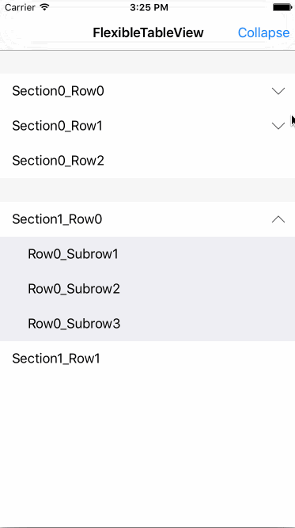

#Swift 3.0 --- Project converted to latest swift 3.0 syntax.  


# FlexibleTableView

A flexible tableview used on iOS implement by swift.

Inspired By [SKSTableView](https://github.com/sakkaras/SKSTableView).

## Requirements
- iOS 10
- Xcode 8.0
- Swift 3.0

## Installation

FlexibleTableView is available through [CocoaPods](http://cocoapods.org).

```ruby
pod "FlexibleTableView"
```

## Screenshot


## Usage

FlexibleTableView work the same as UITableView but just with one FlexibleTableViewDelegate.

```swift
func tableView(tableView: UITableView, numberOfRowsInSection section: Int) -> Int
func tableView(tableView: UITableView, numberOfSubRowsAtIndexPath indexPath: NSIndexPath) -> Int
func tableView(tableView: UITableView, cellForRowAtIndexPath indexPath: NSIndexPath) -> UITableViewCell
func tableView(tableView: UITableView, cellForSubRowAtIndexPath indexPath: FlexibleIndexPath) -> UITableViewCell
```

## License

FlexibleTableView is available under the MIT license. See the LICENSE file for more info.
